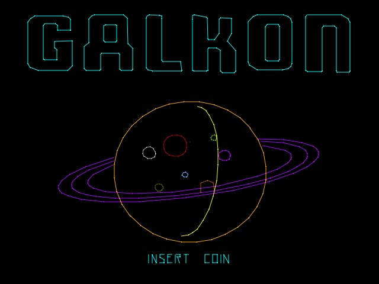
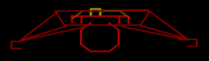

# Sega G80 Vector Development Kit

## New games written for a vintage 1982 vector arcade machine





* Follow the development progress on [YouTube shorts](https://youtube.com/playlist?list=PL5WwuS3ViybqfLWkKmgaT5_N2kVawZYZk)
* Not emulated, not MAME, no Raspberry Pi, no Teensy, no ESP32, no kidding.
* Runs as it would have in 1982 on the original Sega G80 boardsets
* Runs on a Zilog Z80 at 3.86712 MHz, less than 32KB ROM and 2KB RAM
* Integrates with the Sega XY vector coprocessor (a two board set of 74k logic)
* Programmed bare metal C
* Loads and works with 8035 CPUs on the sound and speech boards
* Burn directly to 2716 ROMs and run in the real game
* Can also run without hardware, just copy over the StarTrek MAME ROMs

# Building the ROM yourself
```
export PATH=${PATH}:/Users/jmathews/Desktop/z88dk/bin
export ZCCCFG=/Users/jmathews/Desktop/z88dk/lib/config
make
```
## Dependencies
* https://github.com/z88dk/z88dk/releases
* export PATH=${PATH}:/Users/jmathews/Desktop/z88dk/bin
* export ZCCCFG=/Users/jmathews/Desktop/z88dk/lib/config
* ROM Emulator https://github.com/Kris-Sekula/EPROM-EMU-NG/

# Convert back and forth from Sega Vectors to Scalable Vector Graphics 
* Dump original Sega Vector graphics
* Insert new graphics to Sega Vector system
```
python3 tools/sega2svg.py
python3 tools/svg2sega.py
```
# Convert back and forth from Sega Speech to WAV files 
* Dump original Sega Speech SP0250 LPC binary frames
* Encode new speech into Sega system
```
python3 tools/lpc2wav.py
python3 tools/wav2lpc.py
```





